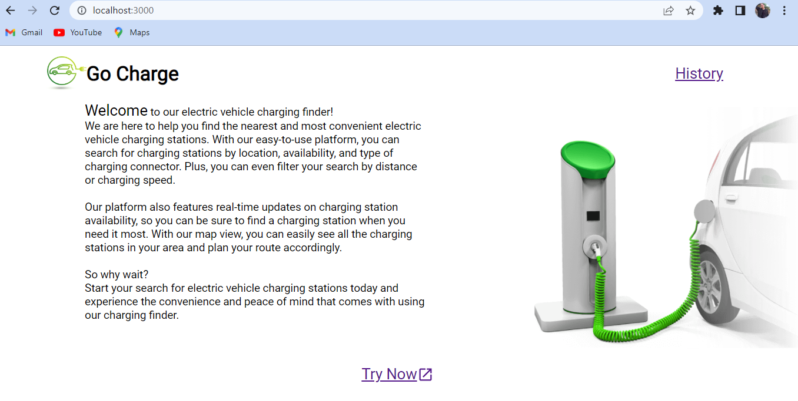
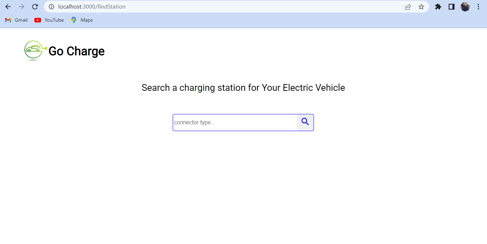
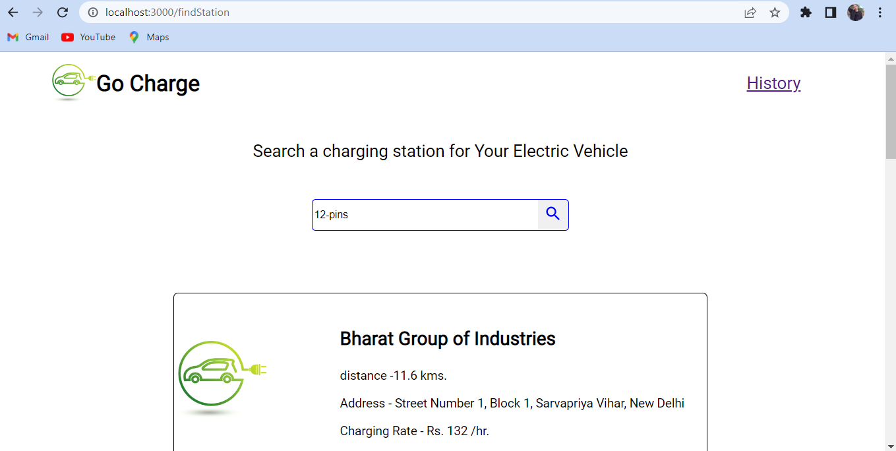
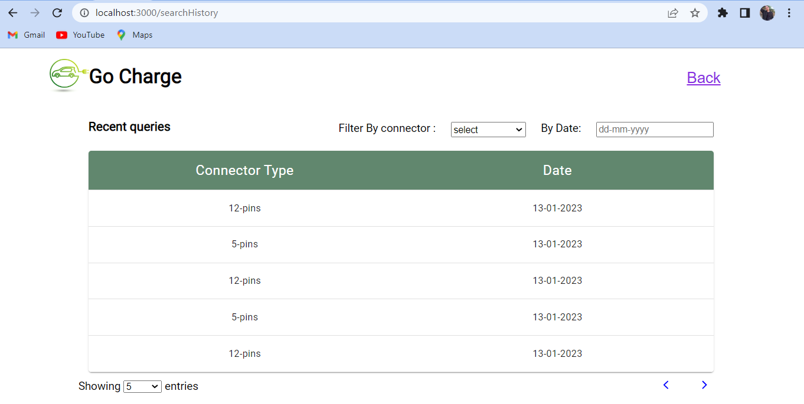

# Go-Charge

## Project Description:

 Go-Charge is an web application made of using JavaScript's very popular library React - Js with TypeScript.It has a HomePage which has some information about what application is about and what it can do to help you.It also has a second page that is routed from HomePage, containing a input box which requires for a connector type of an electric vehicle charger. Application search for electric vehicle charging station around out by filtering out according to your query. It show their useful information like Station Name, it's address, distance from your current location and charging rates to help you to react out to them.

## Technology Used :

- React JS : JavaScript's library React.js is used to develop the application.
- Type Script : To make application more secure and type strict.
- JavaScript : JavaScript's basics and some advanced concepts like API calling, Error Handling is used in the application.
- JSX : JavaScript XML is used to structure the page and using Different UI components inside React.js.
- Matrial CSS : MUI makeStyle is used to style the page and make it more attractive and user's eye comfortable.
- Redux : Redux Library is used to managing state for entire application.
- React Router - React Router is used to communicate between different pages.
- Node JS : Node Js is used to create backend runtime environment and connectivity to database.
- Express JS : Express Js is used to provide routes to various APIs with various controllers.
- MongoDB : MongoDB is used as primary database.
- Moongoose : Mongoose is used to create and manage secure data in mongoDB Collections.

## What I've Learnt :

I have Learnt :

- About APIs, getting data with query and params.
- Redux and React-Redux for State Management.
- Filtereing Data according to our need.
- Mapping of Data.
- Creating basic API and operating CRUD on them.
- Creating cloud database and connectivity.
- Creating different routes, controllers and middlewares.

## _Setup Project_

This application needs its back-end server active before running the application.

Get a clone of the back-end environment from [here](https://github.com/yogesh-haryana/GoCharge-Backend.git)

Get a clone of front-end application from [Here](https://github.com/yogesh-haryana/Go-Charge-Redux-TS.git)

## Available Scripts

### For Backend 

- Go to the root directory
### `cd src`

- Start the server
### `node app.js`

Server is now started on [http://localhost:7000](http://localhost:7000)

### For Application 

In the project directory, you can run:

### `npm start`

Runs the app in the development mode.
Open [http://localhost:3000](http://localhost:3000) to view it in your browser.

The page will reload when you make changes.
You may also see any lint errors in the console.

### `npm test`

Launches the test runner in the interactive watch mode.

### `npm run build`

Builds the app for production to the `build` folder.
It correctly bundles React in production mode and optimizes the build for the best performance.

The build is minified and the file names include the hashes.
Your app is ready to be deployed!

## How to run - Screenshots Tutorial

Homepage

Search Bar

Stations Information

History Page

